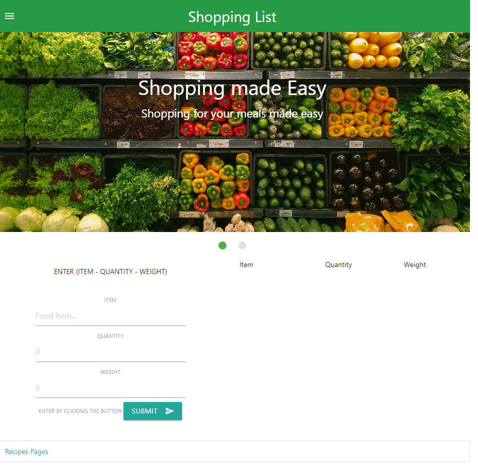

## Shopping List

# Creating a shopping list

The user can input items they desire to have on the list and pressing the submit button at the bottom
each entry has item , quantity and weight which is stored as text in the local storage as an array.
If the user does not enter the food item the webpage will produce an alert that they have to input a food item to proceed.
THe weight and quantity are not necessary to input. if left blank the app will store the text "none" in the array.
The array can only be cleared when the browser reloads

# Displaying the shopping list

If the user wants to see the entirety of the shopping list all they  have to do is press next page and display
the entire shopping list is displayed with indicator for allergic food items are highlighted in red with an asterisks at the end.

# Webpage image of the shopping list

# Demonstration Video

<video src="Untitled%20video.mp4" controls title="Title"></video>
